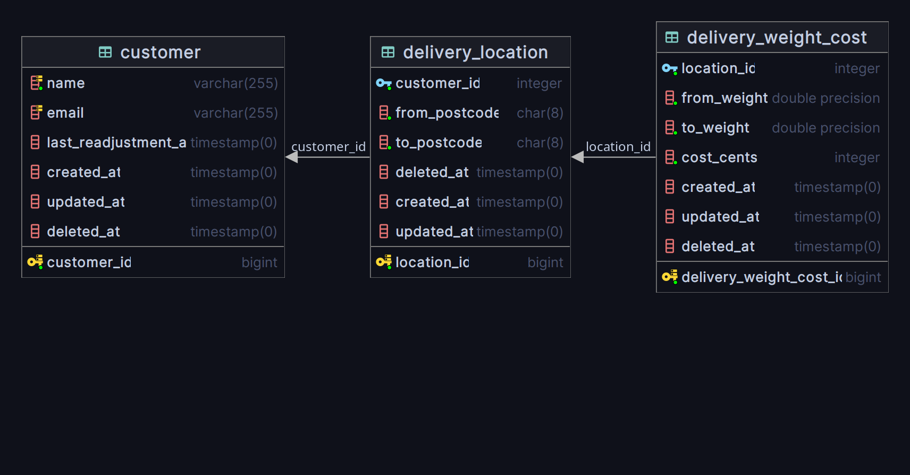

# Testello
--
### Ambiente
Com o intuito de agilizar a preparação do ambiente de desenvolvimento com docker, foi utilizado o pacote [Laravel Sail](https://laravel.com/docs/9.x/sail).
Para subir os containers, execute o seguinte comando na pasta raiz do projeto
```shell
./vendor/bin/sail up
```

Execute o seguinte comando para criar um link simbólico com a pasta pública, necessário para realizar os uploads/downloads de arquivos
```shell
./vendor/bin/sail php artisan storage:link
```

### Banco de dados
O esquema de tabelas construído para guardar os dados do teste pode ser visualizado no diagrama, gerado pelo [PHPStorm](https://www.jetbrains.com/help/phpstorm/creating-diagrams.html), a seguir:

